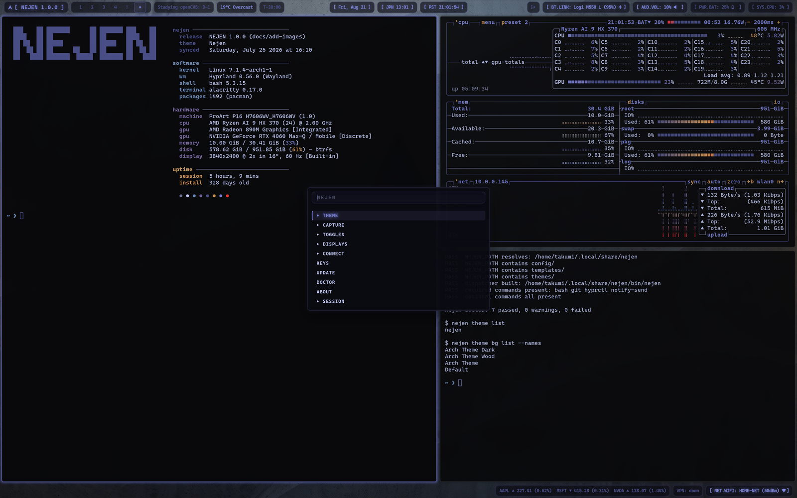
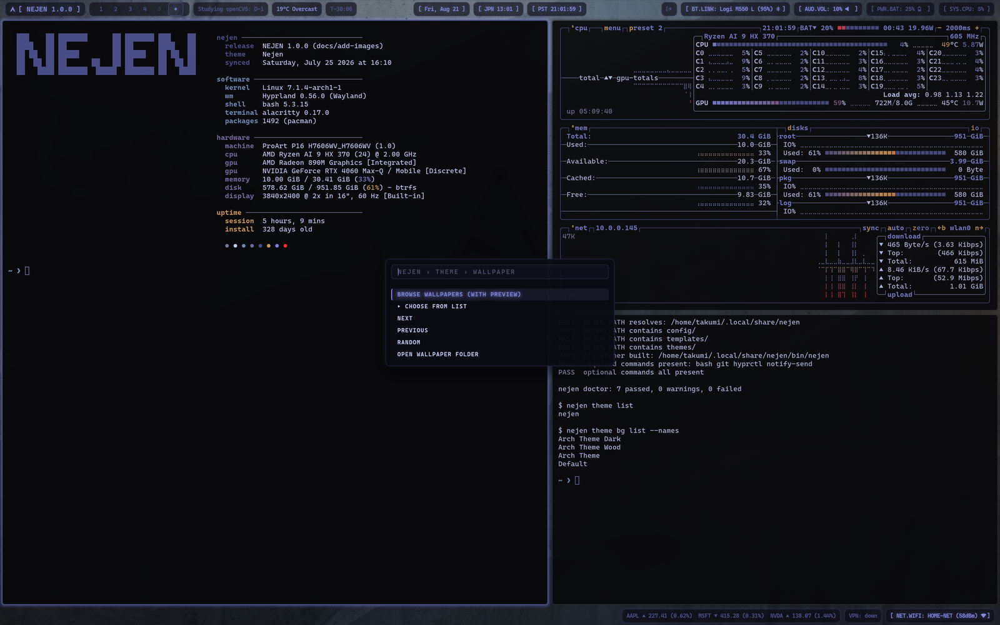
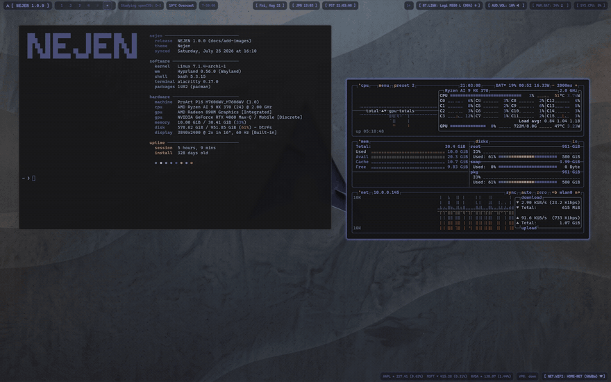
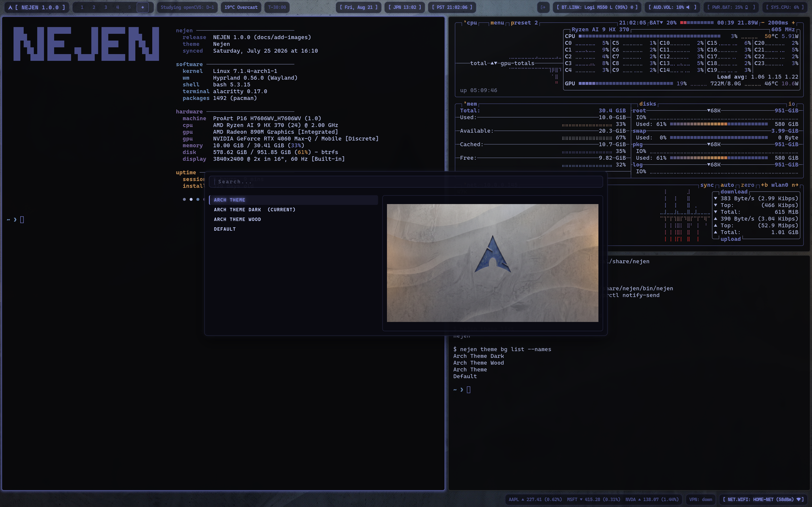
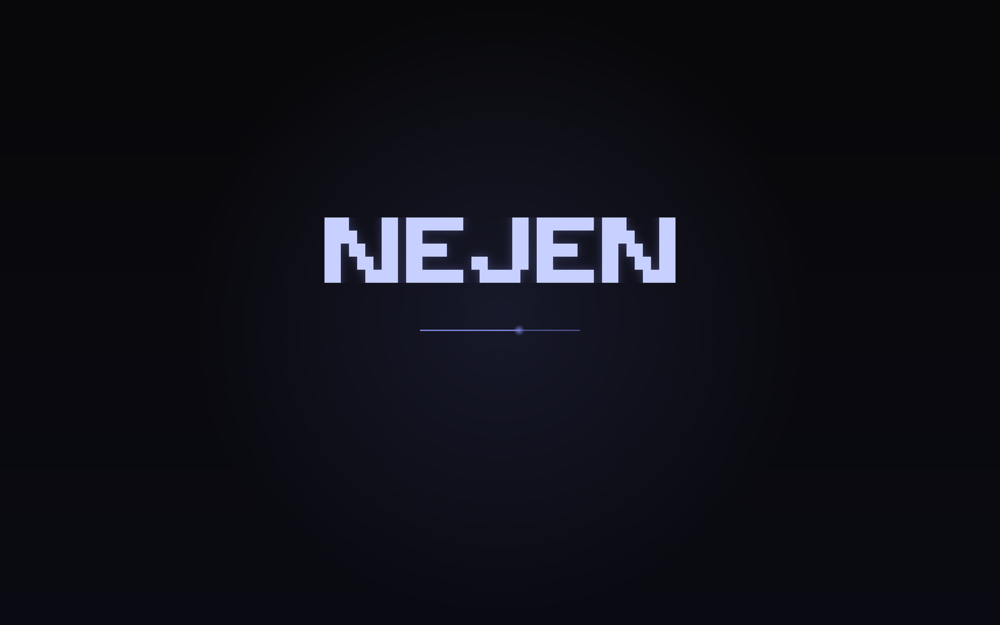
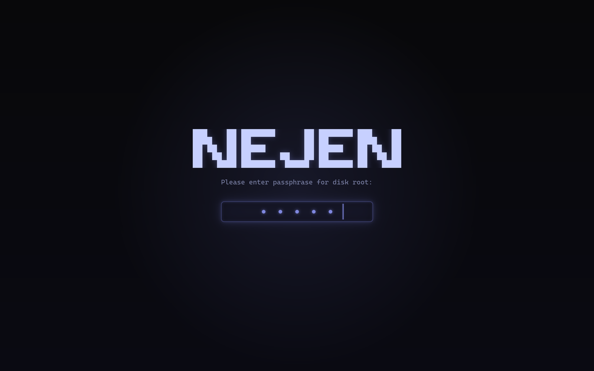
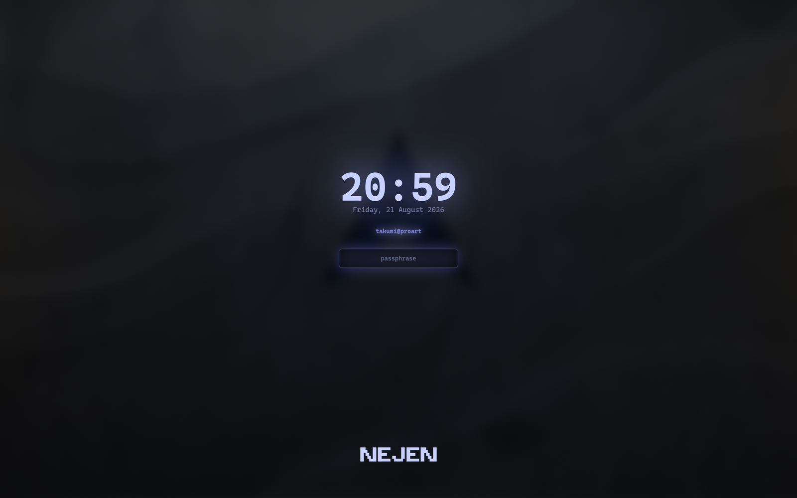

# NEJEN

NEJEN is a minimal Hyprland desktop environment for Arch Linux, designed as a fast, daily-driver setup with a clean separation between system defaults and user overrides.


## Key Features

* **Curated Hyprland Stack**: Waybar, Walker, Mako, SwayOSD, and Hypridle/Hyprlock configured out of the box with zero bloat.
* **Unified CLI**: System actions, themes, and toggles are managed through a single `nejen` binary (e.g., `nejen theme set`, `nejen doctor`).
* **Safe Overrides**: System defaults stay in the install directory. Every app gets a dedicated override file in `~/.config` that loads last and is never touched by an update.
* **TOML Themes & Keymaps**: Define themes and shortcuts in simple TOML files. `nejen` automatically renders them into native application configs and generates a dynamic cheat sheet.

## The Hub

Actions without dedicated shortcuts live in a central menu accessed with `Super+N`. Items are ordered to match the CLI command they trigger.



Each branch opens one level at a time, and the prompt carries a breadcrumb of where you are. `Escape` steps back up a level rather than closing the menu, so a wrong turn costs nothing. All entries are defined in `config/hub.toml`, keeping menu configuration declarative and decoupled from the binary.



Wallpapers can be changed directly from the hub menu or via keyboard shortcuts:



## Requirements

* **Arch Linux**, or a derivative that uses `pacman`.
* **`git`**, to clone the repository.
* **`go`**, which compiles the `nejen` dispatcher. This is a standing requirement rather than a one-off build dependency: `nejen update` rebuilds the binary after every pull.
* **`base-devel`**, for `makepkg`. Parts of the desktop come from the AUR and have to be built, notably `walker` and `elephant` (the launcher and the hub backend).

```sh
sudo pacman -S --needed git go base-devel
```

If `paru` or `yay` is already on `PATH`, the installer uses it. If neither is, it builds `paru` from the AUR first; that pulls a Rust toolchain as a build dependency and adds a few minutes to the first install. Everything else listed in `packages/core.txt` is installed for you.

## Installation

Clone the repository into place and run the installer:

```sh
git clone https://github.com/negensystems/nejen.git ~/.local/share/nejen
cd ~/.local/share/nejen
./install.sh
```

This sets up a whole desktop, so it is not a light touch. The installer will:

* install every package in `packages/core.txt` through `pacman` and an AUR helper, bootstrapping `paru` if you have neither it nor `yay`;
* compile `bin/nejen` and link it into `~/.local/bin`, with bash completion;
* write generated configs for Hyprland, Waybar, Alacritty, SwayOSD, Mako, btop, and bluetuith into `~/.config`, and symlink the `fastfetch`, `walker`, `nvim`, and `uwsm` config directories;
* append a `source` line to `~/.bashrc`, and create `~/.XCompose` if you do not already have one;
* enable a systemd user timer for battery monitoring on laptops.

Any file it would overwrite that NEJEN did not generate is moved aside to `<file>.pre-nejen.bak` first, so an existing setup stays recoverable. Pass `--no-packages` to skip the package step on a machine that already has them.

After installing, log into a Hyprland session and verify your setup:

```sh
nejen doctor
```

## Commands

All desktop operations route through the `nejen` binary. Inspect active shortcuts anytime with `nejen keys` (or `Super+/`), and run `nejen help` for the command summary.

The cheat sheet is generated directly from `keymap.toml` to stay in sync with your config:

## Usage

NEJEN is managed through a single command, `nejen`. Subcommands provide access to settings, actions, and system states.

### Core Shortcuts

These are the essential bindings for navigating the desktop and managing windows:

| Action | Key |
| --- | --- |
| **Open Terminal** | `Super+Enter` (`Super+Return`) |
| **Open Terminal (tmux)** | `Super+Alt+Enter` |
| **Move Focus** | `Super + H/J/K/L` (Vim directional) |
| **Move Window** | `Super + Shift + H/J/K/L` |
| **Toggle Floating** | `Super+T` |
| **Drag Floating Window** | `Super + Left Click` (hold and drag) |
| **Resize Floating Window** | `Super + Right Click` (hold and drag) |
| **Switch Workspace** | `Super + 1-0` |
| **Move to Workspace** | `Super + Shift + 1-0` |
| **Close Window** | `Super+Q` |

### General

| Command | Description |
| --- | --- |
| `nejen doctor` | Check system health and dependencies |
| `nejen update` | Pull repository updates and upgrade packages |
| `nejen search <query>` | Search official and AUR packages |
| `nejen version` | Show the installed NEJEN version |
| `nejen keys` | Open the searchable keybinding sheet |
| `nejen hub` | Open the main action menu (`Super+N`) |
| `nejen hub session` | Open power and session menu (`Super+Shift+N`) |
| `nejen lock` | Lock the screen (`Ctrl+Escape`) |

### Theming & Display

| Command | Description |
| --- | --- |
| `nejen theme list` | List installed themes |
| `nejen theme set <name>` | Switch theme and reload app configs |
| `nejen theme current` | Show the active theme name |
| `nejen theme bg pick` | Open wallpaper selector (`Super+Shift+W`) |
| `nejen night toggle` | Toggle night light warmth filter (`Super+W`) |
| `nejen bar toggle` | Toggle Waybar visibility (`Super+B`) |
| `nejen bar restart` | Restart Waybar |

### Window Management

| Command | Description |
| --- | --- |
| `nejen win detach` | Float and pin active window (`Super+U`) |
| `nejen win gaps` | Toggle window gaps (`Super+G`) |
| `nejen win layout` | Toggle dwindle and master layouts (`Super+Y`) |
| `nejen win square` | Toggle 1:1 aspect ratio on single windows (`Super+O`) |
| `nejen win close-all` | Close all windows on current workspace |

### Hardware & Utilities

| Command | Description |
| --- | --- |
| `nejen screenshot` | Screenshot selected region (`Print`) |
| `nejen screenrecord` | Start or stop screen recording (`Super+R`) |
| `nejen keyboard clean` | Lock keyboard input for cleaning (`Super+Alt+K`) |
| `nejen dnd toggle` | Toggle notification Do Not Disturb (`Super+Ctrl+D`) |
| `nejen idle toggle` | Toggle sleep inhibitor / caffeine (`Super+I`) |
| `nejen audio switch` | Cycle active audio output device |
| `nejen keymap render` | Re-render Hyprland keybindings from `keymap.toml` |

## Customization

Place your overrides in the corresponding files. These load last and take priority over the shipped defaults, and no update touches them:

* **Keybindings**: `~/.config/nejen/keymap.toml`
* **Hub Actions**: `~/.config/nejen/hub.toml`
* **Hyprland Settings**: `~/.config/hypr/overrides.conf`
* **Waybar Styling**: `~/.config/waybar/overrides.css`
* **Alacritty Configuration**: `~/.config/alacritty/overrides.toml`
* **Custom Themes**: `~/.config/nejen/themes/<name>/theme.toml`
* **Wallpapers**: `~/.config/nejen/backgrounds/`

The files these sit alongside (`~/.config/hypr/hyprland.conf`, `~/.config/waybar/style.css`, and the rest) are generated, carry a `DO NOT EDIT` header, and *are* rewritten on every install and update. Edit the override file, not the generated one.

### Creating Custom Color Themes

NEJEN uses a universal color palette. When you change a theme color, it automatically applies to Waybar, Alacritty, Hyprlock, Neovim, and everything else in the system.

To create your own color theme:
1. Open the hub (`Super+N`) and select **Theme > Clone current theme**.
2. (Or run `nejen theme clone my-theme` in the terminal).
3. The system will create a copy of the current theme and open `~/.config/nejen/themes/<your-theme>/theme.toml` in your editor.
4. Edit the HEX color codes under the `[palette]` block to your liking.
5. Save the file and run `nejen theme set <your-theme>` to instantly apply your new colors across the entire system!

## Wallpapers

Images placed in `~/.config/nejen/backgrounds/` are automatically available in the wallpaper picker and rotation cycle. This directory is theme-independent, so changing themes will not overwrite custom wallpapers.

If your collection lives somewhere else, symlink it into place. Do this before anything creates the directory. `ln -s` pointed at an existing directory nests the link *inside* it rather than replacing it:

```bash
ln -s ~/Pictures/wallpapers ~/.config/nejen/backgrounds
```



| Action | Key | Command |
| --- | --- | --- |
| Browse with previews | `Super+Shift+W` | `nejen theme bg pick` |
| Next wallpaper | `Super+Ctrl+W` | `nejen theme bg next` |
| Previous wallpaper | `Super+Ctrl+Shift+W` | `nejen theme bg prev` |
| Random wallpaper | | `nejen theme bg random` |
| Set a specific wallpaper | | `nejen theme bg set <name\|path>` |
| Add images to collection | | `nejen theme bg add <file>...` |
| List available wallpapers | | `nejen theme bg list [--names]` |
| Show current wallpaper | | `nejen theme bg current [--name]` |
| Print wallpaper directory | | `nejen theme bg dir` |

These actions are also available under **Theme > Wallpaper** in the hub (`Super+N`).

`nejen theme bg set` accepts an absolute path, a filename, or a display name (e.g., `nejen theme bg set "Misty Ridge"` and `nejen theme bg set ~/Pictures/ridge.jpg`). Wallpapers resolve across three layers, first match winning: `~/.config/nejen/backgrounds/`, then the active theme's `backgrounds/` directory under `~/.config/nejen/themes/<name>/`, then the shipped theme's own. A file in an earlier layer shadows a same-named file in a later one. Use `--link` with `nejen theme bg add` to symlink files instead of copying them.

## Cleaning Mode

`nejen keyboard clean` disables keyboard input temporarily so you can safely wipe your keyboard. A Hyprland submap captures all keystrokes during the session, preventing accidental input, shortcut triggers, or dialog responses. A fullscreen countdown overlay displays remaining time and blocks accidental clicks.

| Action | Key | Command |
| --- | --- | --- |
| Clean for 30 seconds | `Super+Alt+K` | `nejen keyboard clean` |
| Custom duration | | `nejen keyboard clean --for 2m` |
| Finish early | middle click | `nejen keyboard clean --stop` |

This mode is also available under **Toggles > Cleaning mode** in the hub (`Super+N`). While active, Waybar shows a `󰌐` indicator that can be clicked to exit immediately.

Durations accept formats like `45`, `45s`, or `1m30s` (clamped between 5 seconds and 5 minutes). You can exit cleaning mode at any time via timeout, `nejen keyboard clean --stop`, middle clicking the overlay, or clicking the Waybar indicator.

## Boot and Lock

Boot splash, lock screen, and system info share a consistent design using the ASCII block mark from `logo.txt`.



On encrypted installations, the Plymouth boot screen prompts for the disk passphrase directly within the splash theme:



`nejen lock` (`Ctrl+Escape`) launches `hyprlock`, themed automatically using your active TOML settings with a blurred background, clock, user info, and passphrase input.



## Built-in Bar Modules

Weather and countdown modules are built directly into the `nejen` binary, so the status bar needs no external script or interpreter:

* **Weather** (`nejen weather`): Location-aware weather via Open-Meteo (no API key required). Set static coordinates in `~/.config/nejen/weather.toml` (useful when on a VPN), or let it auto-detect via IP.
* **Countdown** (`nejen countdown`): Target date counter manageable from Waybar via `nejen countdown menu`. Events are stored in `~/.config/nejen/countdown.json`.

## Project Structure

* `cmd/nejen/`: Go source code for the CLI dispatcher and helper commands.
* `config/`: Default configurations (Hyprland, Waybar, Walker, Alacritty, Neovim, etc.).
* `themes/` & `templates/`: Theme definitions and config templates.
* `packages/`: Package list (`core.txt` for base setup).
* `packaging/`: PKGBUILD for building NEJEN as a pacman-owned package. The git-clone install above is the supported path; see the comments in the file for the rest.

## Why Go?

NEJEN is a single compiled Go binary rather than a tree of shell and Python scripts: no interpreter startup on the paths that run constantly, and a tooling layer a system upgrade cannot break. See [docs/why-go.md](docs/why-go.md) for details.

## Uninstall

There is no automated uninstaller. To back NEJEN out:

```sh
rm -f ~/.local/bin/nejen ~/.local/share/bash-completion/completions/nejen
rm -rf ~/.local/share/nejen ~/.local/state/nejen ~/.config/nejen
```

Then remove the NEJEN `source` line from `~/.bashrc`, delete the now-dangling symlinks under `~/.config` (`fastfetch`, `walker`, `nvim`, `uwsm`, and the generated app configs), and restore anything you want back from its `*.pre-nejen.bak` copy. Packages from `packages/core.txt` are left installed; remove the ones you do not want with `pacman -Rns`.

## License

This project is licensed under the MIT License. See [LICENSE](LICENSE) for details.
